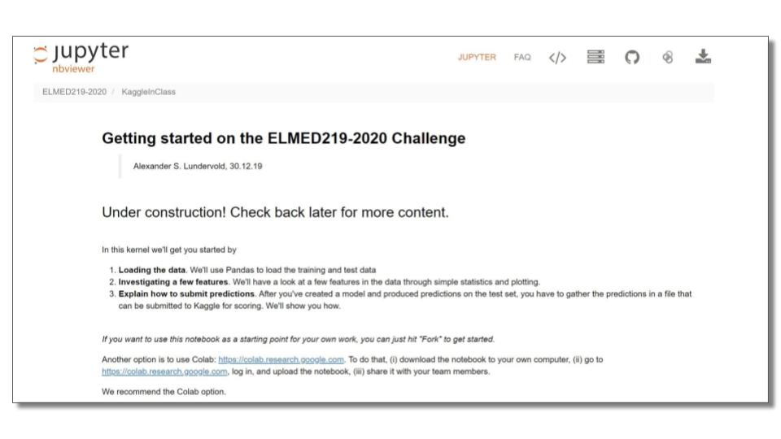

# Om konkurransen
Se MittUiB

# Kom i gang
Du kan bruke notebooken [elmed219-2020-getting-started.ipynb](https://nbviewer.jupyter.org/github/MMIV-ML/ELMED219-2020/blob/master/KaggleInClass/elmed219-2020-getting-started.ipynb) som et utgangspunkt. 

*07.01.20: Notebooken vil bli oppdatert og utvidet*.

